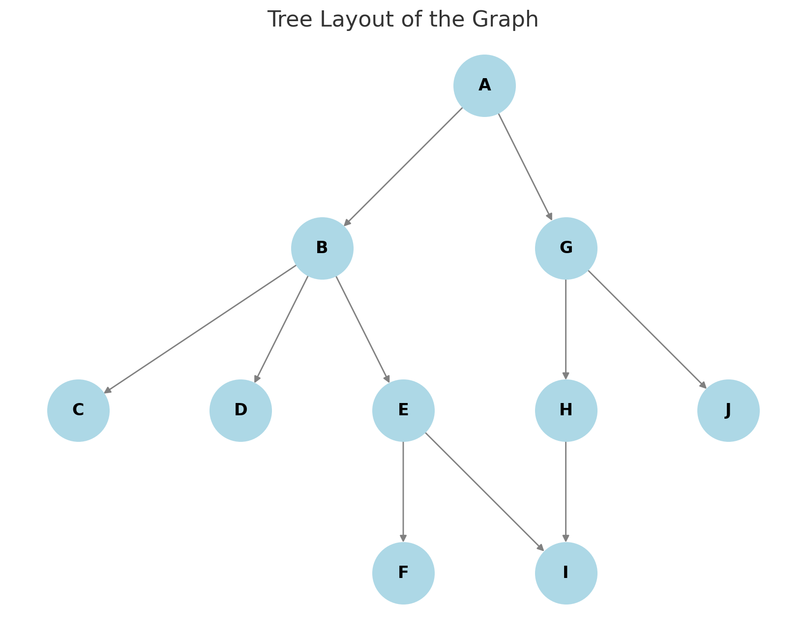

+++
title = "Busca em Largura (BFS) e Busca em Profundidade (DFS): Um Estudo"
description = "Estudando Algoritmos de Busca usando Python, Parte 1"
date = "2025-03-05"
draft = false
toc = false
tags = ["python"]
categories = ["python"]
image = "banner.png"
author = "Fabio M. Lopes"
+++

## Busca em Largura (BFS)
A Busca em Largura (BFS, Breadth-First Search) é um algoritmo fundamental de busca e travessia de grafos. Ele explora sistematicamente um grafo nível por nível, começando a partir de um *nó inicial* designado. BFS explorará todos os caminhos a um passo de distância do ponto de partida, depois todos os caminhos a dois passos de distância e assim por diante, garantindo que o caminho mais curto seja encontrado primeiro.

### Como a BFS Funciona
1. **Inicialização:**
   - Comece com uma estrutura de dados de *fila*, tipicamente implementada usando `collections.deque` em Python para operações FIFO (First-In, First-Out - Primeiro a Entrar, Primeiro a Sair) eficientes. A fila inicialmente contém apenas o *nó inicial*.
   - Mantenha um conjunto (ou lista) `visited` para rastrear os nós que já foram explorados, a fim de evitar ciclos.
   - Opcionalmente, um dicionário `parent` é usado para armazenar o predecessor de cada nó visitado, permitindo a reconstrução do caminho mais tarde.

2. **Iteração:**
   - Enquanto a fila não estiver vazia:
     - Remova um nó da frente da fila. Este é o nó que está sendo explorado atualmente.
     - Para cada *vizinho* do nó atual:
       - Se o vizinho não foi visitado:
         - Marque o vizinho como visitado.
         - Enfileire o vizinho.
         - Registre o nó atual como o *pai* do vizinho (se a reconstrução do caminho for necessária).

3. **Terminação:**
   - O algoritmo termina quando a fila está vazia, indicando que todos os nós alcançáveis a partir do nó inicial foram explorados.
   - Se um *nó alvo* for especificado, a busca pode terminar assim que o nó alvo for removido da fila. O dicionário `parent` pode então ser usado para reconstruir o caminho mais curto do nó inicial para o alvo.

### Prós da BFS
*   **Completude:** BFS é *completo*, o que significa que se um caminho existir entre o nó inicial e o nó alvo, BFS *o encontrará*.
*   **Otimidade:** BFS garante encontrar o *caminho mais curto* (em termos de número de arestas) entre o nó inicial e o nó alvo em um grafo não ponderado.
*   **Simplicidade:** O algoritmo é relativamente simples de entender e implementar.

### Contras da BFS
*   **Consumo de Memória:** BFS pode consumir uma quantidade significativa de memória, especialmente para grafos grandes. Isso ocorre porque ele armazena todos os nós no nível atual na fila. No pior caso, onde todo o grafo precisa ser percorrido, a fila pode crescer para conter uma grande fração do número total de nós.
*   **Não Adequado para Grafos Ponderados:** BFS é projetado para grafos não ponderados. Ele encontra o caminho mais curto com base no número de arestas, não no peso total das arestas. Para grafos ponderados, algoritmos como o algoritmo de Dijkstra são mais apropriados.

### Onde a BFS se Destaca
*   **Encontrando Caminhos Mais Curtos (Grafos Não Ponderados):** Sua principal força é encontrar o caminho mais curto em grafos onde todas as arestas têm o mesmo peso (ou nenhum peso).
*   **Teste de Conectividade:** Determinar se dois nós estão conectados em um grafo.
*   **Web Crawlers:** BFS pode ser usado para rastrear páginas da web, explorando links nível por nível.
*   **Análise de Redes Sociais:** Encontrar a cadeia mais curta de conexões entre duas pessoas em uma rede social.
*   **Navegação GPS:** Em cenários onde minimizar o número de "saltos" é mais importante do que a distância total (por exemplo, minimizar o número de transferências no transporte público).

### Onde a BFS Falha
*   **Grafos Ponderados:** Como mencionado anteriormente, BFS não é adequado para encontrar o caminho mais curto em grafos onde as arestas têm pesos diferentes.
*   **Grafos Muito Grandes:** Os requisitos de memória da BFS podem se tornar proibitivos para grafos muito grandes.
*   **Grafos com Altos Fatores de Ramificação:** Grafos onde cada nó tem muitos vizinhos podem levar a uma fila grande e alto consumo de memória.

### Casos de Uso Comuns
*   **Pathfinding em Jogos:** Encontrar o caminho mais curto para um personagem se mover em um ambiente de jogo (onde todos os movimentos têm o mesmo custo).
*   **Roteamento de Rede:** Descobrir a topologia da rede e encontrar os caminhos mais curtos entre os dispositivos.
*   **Coleta de Lixo:** Rastrear objetos alcançáveis na memória para identificar aqueles que podem ser desalocados com segurança.
*   **Redes Peer-to-Peer:** Encontrar os pares mais próximos em uma rede peer-to-peer.

## Busca em Profundidade (DFS)
A Busca em Profundidade (DFS, Depth-First Search) é outro algoritmo fundamental de busca e travessia de grafos. Em vez de explorar um grafo nível por nível como BFS, DFS explora o mais profundamente possível ao longo de cada ramo antes de retroceder. DFS escolherá um caminho e o seguirá até o final, depois retrocederá até o último ponto de ramificação e tentará um caminho diferente.

### Como a DFS Funciona
1. **Inicialização:**
    *   Comece com uma estrutura de dados de *pilha*, tipicamente implementada usando uma lista Python. A pilha inicialmente contém apenas o *nó inicial*.
    *   Mantenha um conjunto (ou lista) `visited` para rastrear os nós que já foram explorados, a fim de evitar ciclos.
    *   Opcionalmente, um dicionário `parent` é usado para armazenar o predecessor de cada nó visitado, permitindo a reconstrução do caminho mais tarde.

2.  **Iteração:**
    *   Enquanto a pilha não estiver vazia:
        *   Retire um nó do *topo* da pilha. Este é o nó que está sendo explorado atualmente.
        *   Se o nó não foi visitado:
            *   Marque o nó como visitado.
            *   Para cada *vizinho* do nó atual:
                *   Se o vizinho não foi visitado:
                    *   Coloque o vizinho no *topo* da pilha.
                    *   Registre o nó atual como o *pai* do vizinho (se a reconstrução do caminho for necessária).

3. **Terminação:**
    *   O algoritmo termina quando a pilha está vazia, indicando que todos os nós alcançáveis a partir do nó inicial foram explorados.
    *   Se um *nó alvo* for especificado, a busca pode terminar assim que o nó alvo for retirado da pilha e verificado se é o alvo. O dicionário `parent` pode então ser usado para reconstruir um caminho (não necessariamente o mais curto) do nó inicial para o alvo.

### Prós da DFS
*   **Eficiência de Memória:** DFS geralmente requer menos memória do que BFS, especialmente para grafos profundos. Ele só precisa armazenar os nós no caminho atual que está sendo explorado, em vez de todos os nós no nível atual (como BFS faz).
*   **Implementação Simples:** DFS pode ser implementado recursivamente, tornando o código muito conciso (embora a versão iterativa, usando uma pilha, também seja direta).
*   **Bom para Encontrar *Qualquer* Caminho:** Se você só precisa encontrar *um* caminho entre dois nós (não necessariamente o mais curto), DFS pode ser mais rápido do que BFS.

### Contras da DFS
*   **Não Garante Encontrar o Caminho Mais Curto:** DFS *não* garante encontrar o caminho mais curto. Ele encontra um caminho, mas esse caminho pode ser muito mais longo do que o caminho mais curto.
*   **Pode Ficar Preso em Loops Infinitos:** Se o grafo contém ciclos e o conjunto `visited` não for usado corretamente, DFS pode ficar preso em um loop infinito, explorando os mesmos nós repetidamente.
*   **Pode Explorar Caminhos Irrelevantes:** DFS pode explorar caminhos que estão longe do nó alvo antes de encontrar o alvo.

### Onde a DFS se Destaca
*   **Detectando Ciclos:** DFS é adequado para detectar ciclos em um grafo. Se, durante a travessia, você encontrar um nó que já foi visitado (e ainda está na pilha), isso indica a presença de um ciclo.
*   **Ordenação Topológica:** DFS é usado em algoritmos para ordenação topológica de grafos acíclicos direcionados (DAGs).
*   **Verificação da Existência de Caminho:** Determinar se um caminho existe entre dois nós, mesmo que o caminho mais curto não seja necessário.
*   **Resolvendo Quebra-Cabeças:** DFS pode ser usado para explorar possíveis soluções em quebra-cabeças e jogos (por exemplo, resolver um labirinto, encontrar uma solução para um quebra-cabeça Sudoku).

### Onde a DFS Falha
*   **Encontrando Caminhos Mais Curtos:** Quando o caminho mais curto é necessário, BFS ou outros algoritmos como o algoritmo de Dijkstra são melhores escolhas.
*   **Grafos com Caminhos Longos:** Em grafos com caminhos muito longos, DFS pode levar muito tempo para encontrar o nó alvo ou explorar todo o grafo.
*   **Grafos Infinitos:** DFS pode se perder em grafos infinitos se não houver uma condição de terminação clara.

### Casos de Uso Comuns
*   **Detecção de Ciclos:** Como mencionado anteriormente, DFS é comumente usado para detectar ciclos em grafos.
*   **Ordenação Topológica:** Ordenar tarefas em um projeto com base em dependências.
*   **Resolvendo Labirintos:** Encontrar um caminho da entrada para a saída.
*   **Algoritmos de Backtracking:** Resolver problemas onde você precisa explorar diferentes possibilidades e retroceder quando um beco sem saída é alcançado (por exemplo, resolver problemas de satisfação de restrições).
*   **IA de Jogos:** Implementar IA para jogos onde a IA precisa explorar possíveis movimentos e avaliar suas consequências.

Adicionei abaido dois exemplos, um para BFS e outro para DFS. O grafo usado foi este abaixo:



Esta é a saída de ambos, onde podemos notar as diferenças:

```bash
bfs.py
Sequence of visited nodes: ['D', 'F', 'C', 'B', 'H', 'I', 'J', 'E', 'G', 'A']
Visited a total of 10 nodes.
Found path from A to F: ['A', 'B', 'E', 'F']
```

```bash
dfs.py
Sequence of visited nodes: ['A', 'G', 'J', 'H', 'I', 'B', 'E', 'F']
Visited a total of 8 nodes.
Found Path from A to F: ['A', 'B', 'E', 'F']
```

<details>
<summary><b>BFS Example</b> (Click to Show/Hide)</summary>

```python
from collections import deque

def breadth_first_search(graph, start_node, target_node=None):
    visited, queue, parent = {start_node}, deque([start_node]), {}
    while queue:
        node = queue.popleft()
        if target_node == node:
            path = [node]
            while node != start_node: node = parent[node]; path += [node]
            return list(visited), path[::-1]
        for neighbor in graph.get(node, []):
            if neighbor not in visited: visited.add(neighbor); queue += [neighbor]; parent[neighbor] = node
    return list(visited), None

if __name__ == '__main__':
    graph = {
        'A': ['B', 'G'],
        'B': ['C', 'D', 'E'],
        'C': [],
        'D': [],
        'E': ['F', 'I'],
        'F': [],
        'G': ['H', 'J'],
        'H': ['I'],
        'I': [],
        'J': [],
    }

    start_node = 'A'
    target_node = 'F'
    visited, path = breadth_first_search(graph, start_node, target_node)

    print(f"Sequence of visited nodes: {visited}")
    print(f"Visited a total of {len(visited)} nodes.")
    if path:
        print(f"Found path from {start_node} to {target_node}: {path}")
    elif not target_node:
        print(f"Target was not specified.")
    else:
        print(f"No path found from {start_node} to {target_node}.")
```
</details>

<details>
<summary><b>DFS Example</b> (Click to Show/Hide)</summary>

```python
def depth_first_search(graph, start_node, target_node=None):
    visited, stack, parent = [], [start_node], {}
    if start_node not in graph: return visited, None
    while stack:
        node = stack.pop()
        if node not in visited:
            visited += [node]
            if target_node == node:
                path = []
                current = node
                while current in parent or current == start_node:
                    path += [current]
                    if current == start_node: break
                    current = parent[current]
                return visited, path[::-1]
            for neighbor in graph.get(node, []):
                if neighbor not in visited:
                    stack += [neighbor]
                    parent[neighbor] = node
    return visited, None

if __name__ == '__main__':
    graph = {
        'A': ['B', 'G'],
        'B': ['C', 'D', 'E'],
        'C': [],
        'D': [],
        'E': ['F', 'I'],
        'F': [],
        'G': ['H', 'J'],
        'H': ['I'],
        'I': [],
        'J': [],
    }

    start_node = 'A'
    target_node = 'F'
    visited, path = depth_first_search(graph, start_node, target_node)

    print(f"Sequence of visited nodes: {visited}")
    print(f"Visited a total of {len(visited)} nodes.")
    if path:
        print(f"Found Path from {start_node} to {target_node}: {path}")
    elif not target_node:
        print(f"Target was not specified.")
    else:
        print(f"No path found from {start_node} to {target_node}.")
```
</details>