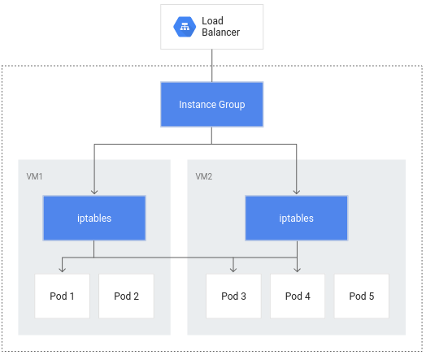
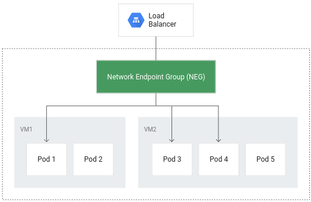

+++
title = "GKE Workload Optimization"
description = "Increase the resource efficiency and availability of workloads running on Google Kubernetes Engine"
date =  "2024-12-09"
draft = false
toc = false
categories = ["gcp", "kubernetes" ]
tags = ["gcp", "kubernetes" ]
image = "gke.png"
author = "Fabio M. Lopes"
+++

Cloud's pay-as-you-go billing offers significant cost advantages, rewarding efficient resource utilization. Optimizing resource allocation is crucial for both application performance and cost control. GKE provides various tools and techniques to minimize resource consumption while maximizing application uptime.

This lab explores key concepts for enhancing workload efficiency and availability within GKE. By strategically managing cluster resources and workloads, you can ensure optimal resource use and minimize unnecessary expenses.

What we'll go through:

 - deploy a GKE cluster
 - Create a container-native load balancer through ingress
 - Load test the application
 - Create a pod disruption budget

Prerequisites:
 - A GCP Account
 - Cloud Shell access

We'll be using Google Cloud Shell, since it is a perfect lab environment for GCP - it's pre-configured, directly integrated with your project, persistent, and free, saving setup time and costs while simplifying the workflow.

#### 1. Initial setup:

Choose a zone to deploy the resources: you can check available zones with `gcloud compute zones list`. To select us-west4-a as the default zone, use `gcloud config set compute/zone us-west4-a`. 

I also like to create an `alias k=kubectl` to make things easier.


#### 2. Deploy a simple 3 node GKE cluster:

`gcloud container clusters create test-cluster --num-nodes=3  --enable-ip-alias`

**Important**: The `--enable-ip-alias` flag is included in order to enable the use of alias IPs for pods which will be required for container-native load balancing through an ingress.

It takes 10-15 minutes for the GKE cluster to be deployed.

#### 3. Deploy a simple HTTP web app as a pod:

Create a file called `gb_frontend_pod.yaml`:
```yaml
apiVersion: v1
kind: Pod
metadata:
  labels:
    app: gb-frontend
  name: gb-frontend
spec:
    containers:
    - name: gb-frontend
      image: gcr.io/google-samples/gb-frontend-amd64:v5
      resources:
        requests:
          cpu: 100m
          memory: 256Mi
      ports:
      - containerPort: 80
```

Apply the manifest to the cluster with `k apply -f gb_frontend_pod.yaml`.

#### 4. Container-native load balancing through ingress

By making pods the fundamental unit for load balancing, container-native load balancing streamlines traffic routing. This minimizes network hops, resulting in lower network consumption, faster performance, and evenly distributed traffic across your application's pods. Furthermore, it enables granular, application-level health checks. To make use of this feature, ensure the GKE cluster was created with VPC-native mode enabled (indicated by the presence of the `--enable-ip-alias` flag during GKE cluster creation).





Configure a ClusterIP service to route traffic to the pod, thus allowing GKE to create a network endpoint group:

Create a file called `gb_frontend_cluster_ip.yaml`:
```yaml
apiVersion: v1
kind: Service
metadata:
  name: gb-frontend-svc
  annotations:
    cloud.google.com/neg: '{"ingress": true}'
spec:
  type: ClusterIP
  selector:
    app: gb-frontend
  ports:
  - port: 80
    protocol: TCP
    targetPort: 80
```

Apply the manifest to the cluster with `k apply -f gb_frontend_cluster_ip.yaml`.

On the **annotations** field, notice `cloud.google.com/neg`. This enables container-native load balancing on for the application when the ingress object is created.

Next, create an ingress object:

Create a file called `gb_frontend_ingress.yaml`:
```yaml
apiVersion: networking.k8s.io/v1
kind: Ingress
metadata:
  name: gb-frontend-ingress
spec:
  defaultBackend:
    service:
      name: gb-frontend-svc
      port:
        number: 80
```

Apply the manifest to the cluster with `k apply -f gb_frontend_ingress.yaml`.

When the ingress is created, an HTTP load balancer is created along with a NEG (Network Endpoint Group) in each zone in which the cluster runs. After a few minutes, the ingress will be assigned an external IP.

The load balancer it created has a backend service running in your project that defines how Cloud Load Balancing distributes traffic. This backend service has a health status associated with it.

After a few minutes, everything should be deployed and ready. Then, the health status of the backend service can be checked with:

```bash
BACKEND_SERVICE=$(gcloud compute backend-services list | grep NAME | cut -d ' ' -f2)
gcloud compute backend-services get-health $BACKEND_SERVICE --global
```

Output:
```bash
backend: https://www.googleapis.com/compute/v1/projects/<project_id>/zones/us-west4-a/networkEndpointGroups/k8s1-95c051f0-default-gb-frontend-svc-80-9b127192
status:
  healthStatus:
  - healthState: HEALTHY
    instance: https://www.googleapis.com/compute/v1/projects/<project_id>/zones/us-west4-a/instances/gke-test-cluster-default-pool-7e74f027-47qp
    ipAddress: <ip_addr>
    port: 80
  kind: compute#backendServiceGroupHealth
```

To test the application on a browser, retrieve the external IP with `k get ingress gb-frontend-ingress`.

#### 5. Load testing the application

By load testing the application running on a single pod with no autoscaling configured, we can learn how many concurrent requests it application can handle, how much CPU and memory it requires, and how it might respond to heavy load. That's the reason we didn't use a Deployment or a ReplicaSet. Once the application requirements are better known, the final production version should definitely include a highly available schema. I'll use [Locust](https://locust.io/), open source load-testing framework, to load test the pod. Since it is open source, locust is also low-cost :upside_down_face:

Create a file called `locust_deployment.yaml`:
```yaml
apiVersion: apps/v1
kind: Deployment
metadata:
  name: locust-main
  labels:
    name: locust-main
spec:
  replicas: 1
  selector:
    matchLabels:
      app: locust-main
  template:
    metadata:
      labels:
        app: locust-main
    spec:
      containers:
        - name: locust-main
          image: locustio/locust
          env:
            - name: LOCUST_MODE
              value: main
            - name: TARGET_HOST
              value: http://gb-frontend-svc
          ports:
            - name: loc-main-web
              containerPort: 8089
              protocol: TCP
            - name: loc-main-p1
              containerPort: 5557
              protocol: TCP
            - name: loc-main-p2
              containerPort: 5558
              protocol: TCP
---
apiVersion: v1
kind: Service
metadata:
  name: locust-main
  labels:
    app: locust-main
spec:
  type: LoadBalancer
  ports:
    - port: 8089
      targetPort: loc-main-web
      protocol: TCP
      name: loc-main-web
    - port: 5557
      targetPort: loc-main-p1
      protocol: TCP
      name: loc-main-p1
    - port: 5558
      targetPort: loc-main-p2
      protocol: TCP
      name: loc-main-p2
  selector:
    app: locust-main
---
apiVersion: "apps/v1"
kind: "Deployment"
metadata:
  name: locust-worker
  labels:
    name: locust-worker
spec:
  replicas: 5
  selector:
    matchLabels:
      app: locust-worker
  template:
    metadata:
      labels:
        app: locust-worker
    spec:
      containers:
        - name: locust-worker
          image: locustio/locust
          env:
            - name: LOCUST_MODE
              value: worker
            - name: LOCUST_MAIN
              value: locust-main
            - name: TARGET_HOST
              value: http://gb-frontend-svc
```

Apply the manifest to the cluster with `k apply -f locust_deployment.yaml`.

Obtain the external ip using `k get svc locust-main` to access the Web UI.


Locust allows you to swarm an application as if many simultaneous users were using it. You can simulate traffic by entering the number of users that should be spawned at a certain rate. We'll set 900 for the number of users to simulate and 300 for the spawn rate.

We can observe the load via GCP Console on Kubernetes Engine > Workloads, then selecting the pod: 


The conclusions that can be taken from the graphs are that memory usage doesn't vary much, neither go too high. As for the CPU, it peaked at almost .07, which means 70% of teh CPU request defined for the pod. Going back to the manifest, we can verify that cpu request is set to **100m**, while memory request is set to **256mi**. It is probably safe to reduce the memory request to a lower amount, effectively optimizing the workload. The second takeaway from the load test is that we could configure a horizontal autoscaler to trigger on CPU usage, since the application is CPU-bound.

#### 6. Adding a Pod Disruption Budget

PodDisruptionBudget is a Kubernetes resource that limits the number of pods of a replicated application that can be down simultaneously due to voluntary disruptions. Those disruptions include administrative actions like deleting a deployment, updating a deployment's pod template and performing a rolling update, draining nodes that an application's pods reside on, or moving pods to different nodes.

We'll now replace our single pod with a deployment, making it highly available:

First, remove the pod:
`k delete pod gb-frontend`.

Then, create a file called `gb_frontend_deployment.yaml`:
```yaml
apiVersion: apps/v1
kind: Deployment
metadata:
  name: gb-frontend
  labels:
    run: gb-frontend
spec:
  replicas: 5
  selector:
    matchLabels:
      run: gb-frontend
  template:
    metadata:
      labels:
        run: gb-frontend
    spec:
      containers:
        - name: gb-frontend
          image: gcr.io/google-samples/gb-frontend-amd64:v5
          resources:
            requests:
              cpu: 100m
              memory: 128Mi
          ports:
            - containerPort: 80
              protocol: TCP
```

Apply the manifest to the cluster with `k apply -f gb_frontend_deployment.yaml`.

Last, create the Pod Disruption Budget with `k create poddisruptionbudget gb-pdb --selector run=gb-frontend --min-available 4`.

We are declaring that the minimum number of available pods should be 4, thus ensuring that any operation like draining a node would not succeed in evicting pods from the deployment if it violates the disruption budget. Until Kubernetes is able to deploy a 5th pod on a different node in order to evict the next one, the remaining pods will remain available in order to adhere to the PDB. In this example, the pod disruption budget was configured to indicate min-available but a PDB can also be configured to define a max-unavailable. Either value can be expressed as an integer representing a pod count, or a percentage of total pods.

GKE was used for this lab but it can be replicated in any kubernetes environment, like EKS, AKS or any on-premises cluster.