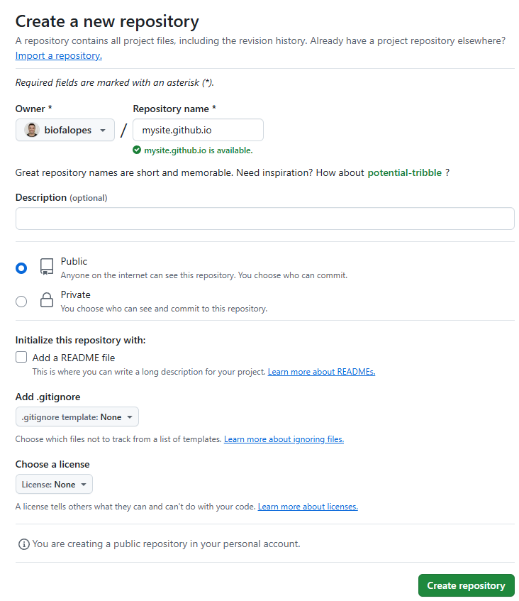
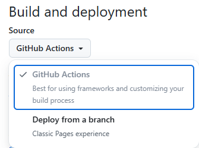
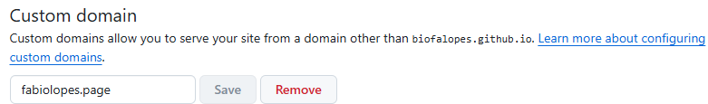
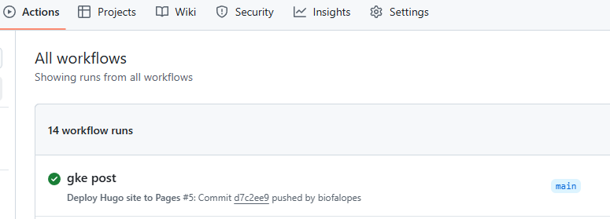

+++
title = "Hugo website on GitHub Pages"
description = "Hosting a static website generated with Hugo on GitHub Pages using GitHub Actions to automate deployment"
date = "2023-05-16"
draft = false
toc = false
categories = ["hugo", "github"]
tags = ["hugo", "github"]
image = "github.png"
author = "Fabio M. Lopes"
+++

I'm gonna describe how this website is hosted and deployed using GitHub and Hugo, with the help of the embedded CI/CD tools to automate the site generation and deployment.

1. The first step is to create a new empty repository on GitHub, with the name following the format `mysite.github.io`. That's how GitHub knows that this repository is going to be a static website:



2. Then, visit the repository you just created. From the main menu choose Settings > Pages. In the center of your screen you will see this:



The default option is "Deploy from a branch". Change it to "GitHub Actions".

You can also choose a custom domain if you don't want to use the default github.io domain:



3. Now, clone the repository locally:

```bash
git clone git@github.com:biofalopes/biofalopes.github.io.git # change according to your username and repository name.
```

Now is time to populate your repository with the workflow yaml. Create a folder called .github and a subfolder called workflows:

```bash
mkdir -p .github/workflows
```

Then, create this yaml file inside. It can have any name, let's use hugo.yaml:

```yaml
# Sample workflow for building and deploying a Hugo site to GitHub Pages
name: Deploy Hugo site to Pages

on:
  # Runs on pushes targeting the default branch
  push:
    branches:
      - main

  # Allows you to run this workflow manually from the Actions tab
  workflow_dispatch:

# Sets permissions of the GITHUB_TOKEN to allow deployment to GitHub Pages
permissions:
  contents: read
  pages: write
  id-token: write

# Allow only one concurrent deployment, skipping runs queued between the run in-progress and latest queued.
# However, do NOT cancel in-progress runs as we want to allow these production deployments to complete.
concurrency:
  group: "pages"
  cancel-in-progress: false

# Default to bash
defaults:
  run:
    shell: bash

jobs:
  # Build job
  build:
    runs-on: ubuntu-latest
    env:
      HUGO_VERSION: 0.137.1
    steps:
      - name: Install Hugo CLI
        run: |
          wget -O ${{ runner.temp }}/hugo.deb https://github.com/gohugoio/hugo/releases/download/v${HUGO_VERSION}/hugo_extended_${HUGO_VERSION}_linux-amd64.deb \
          && sudo dpkg -i ${{ runner.temp }}/hugo.deb          
      - name: Install Dart Sass
        run: sudo snap install dart-sass
      - name: Checkout
        uses: actions/checkout@v4
        with:
          submodules: recursive
          fetch-depth: 0
      - name: Setup Pages
        id: pages
        uses: actions/configure-pages@v5
      - name: Install Node.js dependencies
        run: "[[ -f package-lock.json || -f npm-shrinkwrap.json ]] && npm ci || true"
      - name: Build with Hugo
        env:
          HUGO_CACHEDIR: ${{ runner.temp }}/hugo_cache
          HUGO_ENVIRONMENT: production
          TZ: America/Los_Angeles
        run: |
          hugo \
            --gc \
            --minify \
            --baseURL "${{ steps.pages.outputs.base_url }}/"          
      - name: Upload artifact
        uses: actions/upload-pages-artifact@v3
        with:
          path: ./public

  # Deployment job
  deploy:
    environment:
      name: github-pages
      url: ${{ steps.deployment.outputs.page_url }}
    runs-on: ubuntu-latest
    needs: build
    steps:
      - name: Deploy to GitHub Pages
        id: deployment
        uses: actions/deploy-pages@v4
    ```
```

This yaml is a template provided by the Hugo team, and can be found [here](https://gohugo.io/hosting-and-deployment/hosting-on-github/). What is does is configure the required permissions and settings, download and install hugo's binaries on the runner, run hugo to generate the website and then deploy it to GitHub Pages. This saves you all the hassle of having to do it locally, and you can simply push your markdown files to the repository and everything else will be handled by the Workflow.

The next step is to copy the hugo files. There are many different ways to do that, and I prefer to use a simple method that doesn't involve git submodules or having to install go dependencies locally. That might be necessary depending on the theme you choose, but for my case the basic is enough. The theme I use currently is the Stack, that can be found [here](https://themes.gohugo.io/themes/hugo-theme-stack/). First, clone the theme repository:

```bash
git clone git@github.com:CaiJimmy/hugo-theme-stack.git
```

Almost every theme will have a exampleSite folder inside, which you should copy first:

```bash
cp -r ~/hugo-theme-stack/exampleSite/* ~/mysite.github.io/
```

Next, copy the entire theme to the themes folder:

```bash
mkdir ~/mysite.github.io/themes
cp -r ~/hugo-theme-stack ~/mysite.github.io/themes/
```

It might look a bit counterintuitive or confusing, but the theme must be inside the themes folder. There can be multiple different themes, and hugo will know which one to use through the `hugo.yaml` file on the root folder. The problem is that each theme uses its own set of parameters within hugo's capabilities, and that makes it a bit difficult to seamlessly change themes. I changed the theme of my website a couple of times already, and I had to start fresh every time, bringing just the content and even then having to adjust some things.

The last step is to push everything to GitHub, after configuring and testing your website locally, which I will not get into details here. But basically you have to set all the parameters and then test your pages to verify syntax, image fitment and so on. To push it:

```bash
git add .
git commit -a -m "Initial Commit"
git push
```

If everything worked correctly, you can check the workflow by clicking in the **Actions** menu:



Then it's just a matter of opening the URL and verifying if everything went on correctly. Most of the times when the site is correctly rendered locally but not after publishing, is due to a misconfigured `hugo.yaml` file, usually at the baseurl parameter.