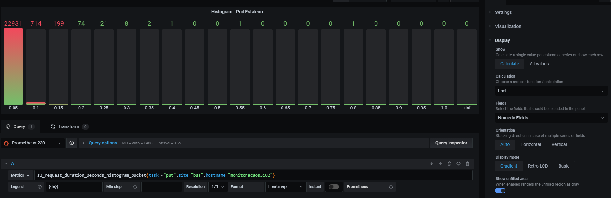
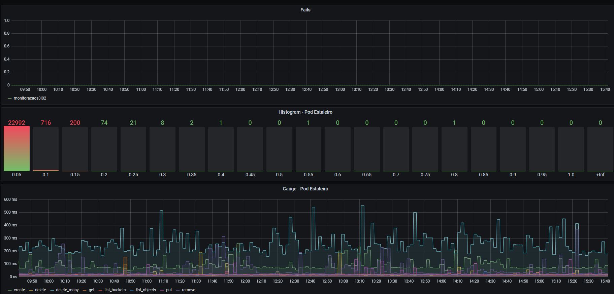

+++
title = "Using Python and Docker to monitor Ceph S3 endpoints externally"
description = "I created a simple application that runs on a Docker container to test and generate metrics on a S3 service - in this case, Ceph"
date = "2021-09-20"
draft = false
toc = false
categories = ["ceph", "python"]
tags = ["ceph", "python"]
image = "decorators.jpg"
+++

I needed to perform external monitoring on our S3 endpoints to better observe how the service was performing, thus getting a better representation of user experience. I use basically Python and Docker to accomplish the task.
<!--more--->  

We have two relatively large Ceph clusters (2.5PB, 600 OSDs) at the company that provides object storage using implementing the S3 API, so we can leverage the AWS SDK and use it to perform operations like creating buckets, putting objects and so on, and measuring the success and the time consumed to perform each operation. With those metrics we can then create graphics, panels and alerts using Grafana for instance.
Using some kind of KISS methodology (keep it simple, stupid), running everything inside a docker container would give the flexibility to throw it anywhere and get the same results. The initial goal was to run two containers on AWS pointing to both sites (where the two main Ceph Clusters live) and two others on each site, one pointing to the other.

For the task I used Python as the programming language with the Prometheus Client for Python, found at https://github.com/prometheus/client_python. I divided the code in sections to talk about each part.

1. Libraries

prometheus_client for metrics, boto3 for s3 connection, random
```
from prometheus_client import Histogram, start_http_server, Summary, Gauge, Counter
import boto3
import random
from io import BytesIO
import os
import time
import logging
```

2. Variables

Here we define our endpoint address, credentials, name of the bucket and objects, the interval between tests, the histogram buckets and how many objects we want to put simultaneously (for histogram metrics):
```
CLUSTER_ENDPOINT = ''
ACCESS_KEY = ''
SECRET_ACCESS_KEY = ''
BUCKET_NAME = 'the_lord_of_buckets'
OBJECT_NAME = 'the_ruler'
PORT=9102
TIME_TO_SLEEP = 120
LOG_LEVEL=logging.INFO
BUCKETS=[0.05, 0.1, 0.15, 0.2, 0.25, 0.3, 0.35, 0.4, 0.45, 0.5, 0.55, 0.6, 0.65, 0.7, 0.75, 0.8, 0.85, 0.9, 0.95 ,1]
OBJCOUNT=15
```

3. Metrics

Here we define what metrics we want to generate, or collect: ALL_TESTSm S3_FAIL, CREATE, PUT, DELETE, GET_OBJECT, LIST_OBJECTS, REMOVE_BUCKET, DELETE_OBJECTS. For each operation there are three metrics defined: Summary, Gauge and Histogram. Labels were used for each operation.

```
ALL_TESTS_SUMMARY = Summary('s3_request_duration_seconds', 'Time spent running the test',['task'])
ALL_TESTS_GAUGE = Gauge('s3_request_last_duration_seconds','Time spent on the last test',['task'])
ALL_TESTS_HIST = Histogram('s3_request_duration_seconds_histogram','Time spent on the last test',['task'],buckets=BUCKETS)
S3_FAIL = Counter('s3_requests_fails', 'Number of fails in this process')
CREATE_BUCKET_SUMMARY = ALL_TESTS_SUMMARY.labels('create')
CREATE_BUCKET_GAUGE = ALL_TESTS_GAUGE.labels('create')
CREATE_BUCKET_HIST = ALL_TESTS_HIST.labels('create')
PUT_OBJECT_SUMMARY = ALL_TESTS_SUMMARY.labels('put')
PUT_OBJECT_GAUGE = ALL_TESTS_GAUGE.labels('put')
PUT_OBJECT_HIST = ALL_TESTS_HIST.labels('put')
DELETE_OBJECT_SUMMARY = ALL_TESTS_SUMMARY.labels('delete')
DELETE_OBJECT_GAUGE = ALL_TESTS_GAUGE.labels('delete')
DELETE_OBJECT_HIST = ALL_TESTS_HIST.labels('delete')
GET_OBJECT_SUMMARY = ALL_TESTS_SUMMARY.labels('get')
GET_OBJECT_GAUGE = ALL_TESTS_GAUGE.labels('get')
GET_OBJECT_HIST = ALL_TESTS_HIST.labels('get')
LIST_OBJECTS_SUMMARY = ALL_TESTS_SUMMARY.labels('list_objects')
LIST_OBJECTS_GAUGE = ALL_TESTS_GAUGE.labels('list_objects')
LIST_OBJECTS_HIST = ALL_TESTS_HIST.labels('list_objects')
LIST_BUCKETS_SUMMARY = ALL_TESTS_SUMMARY.labels('list_buckets')
LIST_BUCKETS_GAUGE = ALL_TESTS_GAUGE.labels('list_buckets')
LIST_BUCKETS_HIST = ALL_TESTS_HIST.labels('list_buckets')
REMOVE_BUCKET_SUMMARY = ALL_TESTS_SUMMARY.labels('remove')
REMOVE_BUCKET_GAUGE = ALL_TESTS_GAUGE.labels('remove')
REMOVE_BUCKET_HIST = ALL_TESTS_HIST.labels('remove')
DELETE_OBJECTS_SUMMARY = ALL_TESTS_SUMMARY.labels('delete_many')
DELETE_OBJECTS_GAUGE = ALL_TESTS_GAUGE.labels('delete_many')
DELETE_OBJECTS_HIST = ALL_TESTS_HIST.labels('delete_many')
```

4. Class S3Metrics

This is where stuff gets done! There is an init function to set the parameters from the variables, start logging and create an a s3 resource from the boto3 library. Decorators were used to measure the time spend in each function and the run_all_tests funcion calls all the tests, which is the one we use as we'll see next.
```
class S3Metrics:
    s3 = None
    bucket = None
    file_size = 512
    data = None
    key_name = None
    data_out = None

    def __init__(self, bucket_name, key_name):
        cluster_endpoint = os.getenv('CLUSTER_ENDPOINT',default=CLUSTER_ENDPOINT)
        access_key = os.getenv('ACCESS_KEY',default=ACCESS_KEY)
        secret_access_key = os.getenv('SECRET_ACCESS_KEY',default=SECRET_ACCESS_KEY)
        log_level = os.getenv('LOG_LEVEL',default=LOG_LEVEL)
        self.bucket = bucket_name
        self.key_name = key_name
        self.generate_data()
        logging.basicConfig(level=int(log_level))
        self.s3 = boto3.resource('s3',
                      endpoint_url=cluster_endpoint,
                      aws_access_key_id=access_key,
                      aws_secret_access_key=secret_access_key)

    @CREATE_BUCKET_HIST.time()
    @CREATE_BUCKET_GAUGE.time()
    @CREATE_BUCKET_SUMMARY.time()
    def create_bucket(self):
        try:
            bucket = self.s3.Bucket(self.bucket)
            bucket.create()
        except:
            S3_FAIL.inc()

    @PUT_OBJECT_HIST.time()
    @PUT_OBJECT_GAUGE.time()
    @PUT_OBJECT_SUMMARY.time()
    def put_object(self,key_name=OBJECT_NAME):
        try:
            bucket = self.s3.Bucket(self.bucket)
            bucket.put_object(
                        Key=key_name,
                        Body=self.data)
        except:
            S3_FAIL.inc()
    
    def put_objects(self):
        for i in range(0,OBJCOUNT):
            self.put_object(self.key_name+str(i))

    @DELETE_OBJECT_HIST.time()
    @DELETE_OBJECT_GAUGE.time()
    @DELETE_OBJECT_SUMMARY.time()
    def del_object(self):
        try:
            object = self.s3.Object(self.bucket,self.key_name)
            object.delete()
        except:
            S3_FAIL.inc()

    @DELETE_OBJECTS_HIST.time()
    @DELETE_OBJECTS_GAUGE.time()
    @DELETE_OBJECTS_SUMMARY.time()
    def del_objects(self):
        try:
            bucket = self.s3.Bucket(self.bucket)
            objects = bucket.objects.all()
            for object in objects:
                object.delete()
        except:
            S3_FAIL.inc()

    @GET_OBJECT_HIST.time()
    @GET_OBJECT_GAUGE.time()
    @GET_OBJECT_SUMMARY.time()
    def get_object(self):
        self.data_out = None
        try:
            bucket = self.s3.Bucket(self.bucket)
            data = BytesIO()
            bucket.download_fileobj(Fileobj=data, Key=self.key_name)
            self.data_out = data.getvalue().decode()
        except:
            S3_FAIL.inc()

    def compare_object(self):
        if self.data != self.data_out:
            S3_FAIL.inc()

    @LIST_BUCKETS_HIST.time()
    @LIST_BUCKETS_GAUGE.time()
    @LIST_BUCKETS_SUMMARY.time()
    def list_buckets(self):
        try:
            all_buckets = self.s3.buckets.all()
            for bucket in all_buckets:
                logging.debug("%s %s", bucket.creation_date, bucket.name)
        except:
            S3_FAIL.inc()

    @LIST_OBJECTS_HIST.time()
    @LIST_OBJECTS_GAUGE.time()
    @LIST_OBJECTS_SUMMARY.time()
    def list_objects(self):
        try:
            bucket = self.s3.Bucket(self.bucket)
            objects = bucket.objects.all()
            for object in objects:
                logging.debug("%s", object.key)
        except:
            S3_FAIL.inc()

    @REMOVE_BUCKET_HIST.time()
    @REMOVE_BUCKET_GAUGE.time()
    @REMOVE_BUCKET_SUMMARY.time()
    def remove_bucket(self):
        try:
            bucket = self.s3.Bucket(self.bucket)
            bucket.delete()
        except:
            S3_FAIL.inc()

    def run_all_tests(self):
        self.create_bucket()
        self.put_object()
        self.list_buckets()
        self.list_objects()
        self.get_object()
        self.compare_object()
        self.del_object()
        self.put_objects()
        self.del_objects()
        self.remove_bucket()

    def generate_data(self):
        MAX_LIMIT = 126
        data = ''
        for _ in range(self.file_size):
            random_integer = random.randint(32, MAX_LIMIT)
            data += (chr(random_integer))
        self.data = data
```

 5. Main

Here we start the prometheus exporter and call the method run_all_tests() from class S3Metrics inside an infinite while loop, so the script will run continuously until manually stopped.
```
def main():
    start_http_server(PORT)
    s3metrics = S3Metrics(BUCKET_NAME, OBJECT_NAME)
    while True:
        s3metrics.run_all_tests()
        time.sleep(TIME_TO_SLEEP)

if __name__ == '__main__':
    main()
```

So now that we have our `s3metrics.py`, we have to build a container to run it. I created a `requirements.txt` file to make it easier to adjust the package versions in the future, and used in the Dockerfile the `python:3` base image since it already have most of what I need. 

6. Requirements

```
boto3==1.17.54
botocore==1.20.54
jmespath==0.10.0
prometheus-client==0.10.1
python-dateutil==2.8.1
s3transfer==0.4.0
six==1.15.0
urllib3==1.26.4
```

7. Dockerfile

```
FROM python:3

WORKDIR /app

COPY requirements.txt .

COPY s3-metrics.py .

RUN python3 -m venv .venv; bash -c 'source .venv/bin/activate'; pip install -r requirements.txt

CMD [ "python", "./s3-metrics.py" ]
```

8. Build and Run

Now we can run the container inside an EC2 instance or anywhere capable of running a docker container (you don't say, lol). I'll later post my terraform script used to deploy it on AWS with more details. Now for the Grafana part:

9. Grafana

Here's how I configured a Bar gauge graph to see the PUT Histogram:



We can see that the majority of the operations take less than 0.5 seconds to finish, so if we start seeing an increase in the other histogram buckets, it means that we probably have a problem.

I also created a panel to watch for errors and one to see all the operations combined:



1.  Conclusion

That kind of monitoring can give a good observability to a service like Ceph S3 Gateway, but this could easily be applied to any other service with some changes. Before that, we used UpTimeRobot to achieve a similar goal, but from my perspective you can have much more control and flexibility with a container like that performing connectivity tests, and in this case we go much deeper by mimicking user operations on our tests.