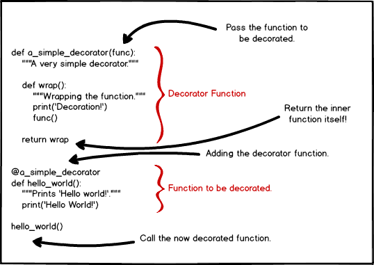

+++
title = "Comparison of Sorting Algorithms using Python Decorators"
description = "Measuring runtime of sorting algorithms using Python decorators"
date = "2020-11-17"
draft = false
toc = false
categories = ["python"]
tags = ["python"]
image = "decorators.jpg"
+++

So I needed to learn how to use decorators in Python.
<!--more--->  I tried to come up with something within my current knowledge and since I was studying sorting algorithms, I decided to use decorators to measure how long each algorithm would take to complete and compare them. I know that it is kind of obvious which one is better in the proposed scenario for anyone with a Bachelor in Computer Science or any experienced developer, but the purpose here was to learn and develop my python skills.

Decorators can be very useful when you need to add functionalities to an existing function/method/class, without having to change its code. Let's say you need to add an additional check, time the function or log but you are using a module instead of writing your own function, or you want to reuse the code more efficiently, then using decorators might be the way to go. 

There are many other ways to use decorators that i still have to explore, like chained decorators for instance.

I found a good post at https://kleiber.me/blog/2017/08/10/tutorial-decorator-primer/ , where the author uses the same example I used (comparing sorting algorithms), but he used the `pygorithm.sorting` module, while I used my own functions.



There are many different ways to approach this, and we can always improve our older codes as we get better at a programming language. With that in mind, here's the code i came up with, using Python 3:
```
import random
import functools
import time

# define the function to measure time
def timeIt(func):
    # wraps the function using functools
    @functools.wraps(func)
    def newfunc(*args, **kwargs):
        # check to enter the function only once
        if not hasattr(newfunc, '_entered'):
            newfunc._entered = True
            # starts the measurement
            startTime = time.time()
            func(*args, **kwargs)
            # finishes the measurement
            elapsedTime = time.time() - startTime
            # prints the result
            print('function [{}] finished in {} ms'.format(
                func.__name__, int(elapsedTime * 1000)))
            del newfunc._entered
    return newfunc

# the @ inserts decorator
@timeIt
def mergeSort(L):
    if len(L) > 1:
        mid = len(L) // 2
        left = L[:mid]
        right = L[mid:]
        mergeSort(left)
        mergeSort(right)
        i = j = k = 0
        while i < len(left) and j < len(right):
            if left[i] < right[j]:
                L[k] = left[i]
                i += 1
            else:
                L[k] = right[j]
                j += 1
            k += 1
        while i < len(left):
            L[k] = left[i]
            i += 1
            k += 1

        while j < len(right):
            L[k] = right[j]
            j += 1
            k += 1


@timeIt
def selectionSort(L):
    for i in range(0, len(L)):
        min_i = i
        for right in range(i + 1, len(L)):
            if L[right] < L[min_i]:
                min_i = right
    L[i], L[min_i] = L[min_i], L[i]


@timeIt
def bubbleSort(L):
    elem = len(L) - 1
    issorted = False
    while not issorted:
        issorted = True
        for i in range(elem):
            if L[i] > L[i + 1]:
                L[i], L[i + 1] = L[i + 1], L[i]
                issorted = False


randomList = random.sample(range(5000), 5000)

mergeSort(randomList.copy())
selectionSort(randomList.copy())
bubbleSort(randomList.copy())
```

And the results:

```
function [mergeSort] finished in 2 ms
function [selectionSort] finished in 930 ms
function [bubbleSort] finished in 2828 ms
```

ecco!

**References:**

https://docs.python.org/3/library/timeit.html

https://stackoverflow.com/questions/5478351/python-time-measure-function

