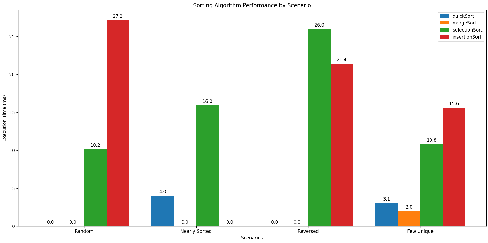

+++
title = "Comparison of Sorting Algorithms using Python"
description = "Revisiting Sorting Algorithms: A Python Diary Entry"
date = "2025-02-27"
draft = false
toc = false
categories = ["python"]
tags = ["python"]
image = "sorting_1.webp"
+++

This blog post documents my journey of revisiting fundamental computer science concepts and sharpening my Python coding skills. After reviewing the classics, I wrote a script to analyze and compare the performance of common sorting algorithms, including QuickSort, MergeSort, SelectionSort, and InsertionSort. Here's an account of the analysis, the code, and the insights gained.

#### Background and Approach
This analysis builds upon a script initially developed during the MITx course "Introduction to Computer Science and Programming Using Python," even incorporating the old post about learning to use decorators. I have since refined the script to remove BubbleSort in favor of InsertionSort, improved code documentation through inline comments and PEP 257-compliant docstrings, and incorporated feedback from a Grok review, including the implementation of randomized pivots in QuickSort to improve its average-case performance.

The aim of the script is to sort lists of 5000 random integers (0 to 4999). I wanted to get a better sense of how they performed, so each algorithm is timed using a decorator. It outputs the time for each run of a list copy and gives a graph at the end.

Before choosing a sorting algorithm, it's essential to understand how the data is structured. Real-world data often falls into one of several common categories: **Random, Nearly Sorted, Reversed,** or **Few Unique**. The choice of sorting algorithm can significantly impact performance depending on the data's characteristics. For example:

*   **Random:** A list of customer IDs in a database, where the order is arbitrary.
*   **Nearly Sorted:** A log file where entries are mostly in chronological order but occasionally have timestamps slightly out of sequence.
*   **Reversed:** A list of scores in a competition sorted from highest to lowest.
*   **Few Unique:** A list of product ratings (1-5 stars), where the number of distinct values is limited.

This consideration is crucial when working with large datasets, where even a small improvement in efficiency (e.g., 10%) can lead to significant savings.

The timing decorator is implemented using `time()` from the `time` library:

```python
def timing(f):
    """Decorator to measure and print the execution time of a function."""
    def wrap(*args, **kwargs):
        starttime = time.time()
        ret = f(*args, **kwargs)
        finishtime = time.time()
        elapsed = (finishtime - starttime) * 1000.0  # Convert to milliseconds
        print(f'function [{f.__name__}] finished in {elapsed:.3f} ms')
        wrap.elapsed_time = elapsed # Store the elapsed time
        return ret, elapsed
    wrap.elapsed_time = 0 # Initialize elapsed_time attribute
    return wrap
```
This code defines a `timing` decorator that runs a start and end timer for a function to determine runtime and measure performance. The result is then stored.

#### Quick Sort: Figuring Out the Pivot
I've read that Quick Sort is one of the most popular sorting algorithms because it's efficient on average. Quick Sort is based on a concept called divide and conquer. It works by recursively partitioning the list around a chosen element, called the pivot. All elements smaller than the pivot are moved to its left, and all elements larger than the pivot are moved to its right. This process is repeated recursively for the left and right partitions until the entire list is sorted.

A good choice of pivot is crucial. If a bad pivot is chosen, like always picking the smallest or largest element, Quick Sort can degrade to O(n²). That's why picking a good pivot, such as using the middle element or a randomized pivot, is crucial. One technique to pick a good pivot is to use "median of three", where we pick the first, middle, and last item, and choose the median of these values. In the worst-case scenario, such as a reversed list and always picking the first element as the pivot, the algorithm makes many comparisons, O(n^2). But if everything is chosen to be perfect, the scenario makes only N log N comparisons

The first time I used Quick Sort I picked the first element as a pivot, which might not be ideal. This time I changed it to pick it randomly, as suggested during a review using Grok.

Despite this worst-case scenario, quickSort is often faster in practice than mergeSort because it doesn’t require extra memory for merging. That's why it is commonly used in real-world applications, including in many programming languages' built-in sorting functions. Depending on the size of the list, memory can become an important factor.

#### Merge Sort: Divide, Conquer, and Combine
Like Quick Sort, Merge Sort employs a divide-and-conquer strategy to sort a list. Instead of sorting the entire list at once, it breaks the list down into smaller, more manageable sublists, sorts them individually, and then merges these sorted sublists back together in a controlled manner.

Here's a breakdown of the process:

1. Divide: The list is recursively divided into two halves until you're left with sublists containing only single elements. Consider the list [5, 2, 4, 6, 1, 3]. It's divided into [5, 2, 4] and [6, 1, 3], then further into [5], [2, 4], [6], [1, 3], and finally, [5], [2], [4], [6], [1], [3].

2. Conquer: Each single-element sublist is inherently sorted (a list of one element is always sorted).

3. Merge: The magic happens during the merging step. The sublists are merged back together in sorted order. For instance, [5] and [2] merge into [2, 5], then [2, 5] and [4] merge into [2, 4, 5]. This continues until the full list is rebuilt, resulting in [1, 2, 3, 4, 5, 6]. The merging is efficient because we're always combining already sorted sublists, which allows for a linear-time (O(n)) merging process.

Merge Sort has a time complexity of O(n log n) in all cases (best, average, worst), making it a reliable choice when consistent performance is crucial. However, this efficiency comes at a cost: Merge Sort requires additional memory space to store the temporary sublists during the merging process, making it a bit less space-efficient than algorithms like quickSort or insertionSort (in their in-place implementations).

#### Selection Sort: Repeated Minimum Finding
Selection Sort offers a straightforward, albeit inefficient, approach to sorting. It works by repeatedly finding the smallest element in the unsorted portion of the list and swapping it with the element at the beginning of the unsorted portion. While coding Selection Sort is relatively simple, its performance, with a time complexity of O(n²), is significantly slower than more advanced algorithms, especially for larger datasets.

Consider the list [5, 2, 4, 6, 1, 3]. Selection Sort would:

1. Find the smallest element (1) and swap it with the first element (5): [1, 2, 4, 6, 5, 3]
2. Find the smallest element in the remaining unsorted portion (2) (skipping already sorted ones) and swap it with the second element: [1, 2, 4, 6, 5, 3]
3. Continue this process, repeatedly finding the minimum and swapping it into its correct position.

The primary disadvantage of Selection Sort is its inefficiency. It always performs a complete scan of the unsorted portion of the list, regardless of whether the list is already partially sorted or not. Also, if you have a situation where reading and writing operations are very costly (for example, if elements are stored on slow hard drives or the network), the many swaps that are involved can affect performance.

#### Insertion Sort: Sorting Like Playing Cards
Insertion Sort is another relatively simple sorting algorithm. One way to think about it is imagining how you sort playing cards in your hand: As you're dealt a new card, you look at the cards you already have and insert the new card into its correct position by shifting the other cards over if needed.

The algorithm works as follows:

1. Start with the second element in the list.
2. Compare it with the element to its left. If the element is smaller, swap them.
3. Keep moving backward, comparing and swapping until you find the correct position for the current element.
4. Move on to the next element and repeat the process.
5. By the time you reach the last element, the entire list is sorted.

To illustrate, consider the list [5, 2, 4, 6, 1, 3]:

1. i=1, current=2. Compare 2 with 5. Swap: [2, 5, 4, 6, 1, 3]
2. i=2, current=4. Compare 4 with 5. Swap: [2, 4, 5, 6, 1, 3]
3. i=3, current=6. Nothing to swap.
4. i=4, current=1. Compare 1 with 6, 5, 4, 2. Swap till front: [1, 2, 4, 5, 6, 3]
5. i=5, current =3 Compare 3 with 6, 5, 4, 2, 1, and stop at [1, 2, 3, 4, 5, 6]

While Insertion Sort is easy to understand and implement, its time complexity is O(n²) in the worst case (e.g., a reversed list), making it slow for large, unsorted datasets. However, Insertion Sort shines when dealing with small lists or lists that are nearly sorted. In these scenarios, it can be surprisingly efficient and may even outperform more complex algorithms like QuickSort or MergeSort. The is because it is an adaptive sort where its performance depends on the nature of the already sorted data, versus the nonadaptive methods (such as mergeSort and selectionSort) where the method will run until the data is sorted.

#### Methodology: Analyzing Sorting Performance
To conduct the analysis, the program follows these steps:

1.  **Data Generation:** Four lists, each representing one of the scenarios described above, are generated. The list size is set to 1000. We did this in order to not reach maximum recursion limits of the sorting methods.
2.  **Sorting and Timing:** For each scenario, each sorting algorithm is applied to a *copy* of the generated list. This ensures that each algorithm operates on the same initial data and that previous sorting operations do not influence subsequent timing results.
3.  **Execution Time Measurement:** A `timing` decorator is used to measure the execution time of each sorting operation in milliseconds.
4.  **Visualization:** The collected timing results are then used to generate a bar chart using the `matplotlib` library. This chart provides a visual comparison of the performance of the sorting algorithms for each scenario, allowing for easy identification of their relative strengths and weaknesses.

#### Results
The following results were obtained on my machine using lists of 5000 integers. Remember that performance can vary depending on hardware and specific data characteristics.



#### Thoughts
The key observations from this analysis are:

*   **QuickSort**: Demonstrated the best overall performance, consistently exhibiting the fastest execution times across most scenarios. The iterative implementation and randomized pivot selection likely contributed to its efficiency.
*   **MergeSort**: Performed reasonably well, consistently with the other scenarios. Due to linear-time process, it's more costly to do it and becomes less fast.
*   **SelectionSort**: Significantly slower than the O(n log n) algorithms, highlighting the practical limitations of its O(n²) time complexity.
*   **InsertionSort**: Showed competitive performance when compared to Selection Sort.

#### Discussion and Next Steps
This analysis provided a valuable reminder of the performance trade-offs inherent in different sorting algorithms. The results clearly illustrate the advantages of O(n log n) algorithms (QuickSort and MergeSort) for larger datasets compared to O(n²) algorithms (SelectionSort and InsertionSort).

While these findings provide a general overview, several avenues remain for further exploration:

*   **Larger Datasets:** Running the analysis with significantly larger list sizes (e.g., 10,000, 50,000, 100,000) would further emphasize the scaling behavior of the algorithms.
*   **Varying Data Characteristics:** Experimenting with different data distributions (e.g., different levels of "nearly sorted," varying the number of unique values) could reveal subtle performance nuances.
*   **Implement `standardSort`** Python can call this function to provide another time measurement.
*   **Compare the Algorithms in Various Scenarios:** Talk about the advantages and the disadvantages from each algorithm in every scenario from the graph.

<details>
<summary><b>Full Code</b> (Click to Show/Hide)</summary>

```python
import time
import random
import functools
from prettytable import PrettyTable
import matplotlib.pyplot as plt

def timing(f):
    """Decorator to measure and print the execution time of a function."""
    def wrap(*args, **kwargs):
        starttime = time.time()
        ret = f(*args, **kwargs)
        finishtime = time.time()
        elapsed = (finishtime - starttime) * 1000.0  # Convert to milliseconds
        print(f'function [{f.__name__}] finished in {elapsed:.3f} ms')
        wrap.elapsed_time = elapsed # Store the elapsed time
        return ret, elapsed
    wrap.elapsed_time = 0 # Initialize elapsed_time attribute
    return wrap

@timing
def quickSort(L):
    """Sorts a list in ascending order using QuickSort with randomized pivot."""
    stack = [(0, len(L) - 1)]  # Initial subarray: entire list

    while stack:
        first, last = stack.pop()  # Get next subarray to sort

        if first < last:
            pivot_idx = random.randint(first, last)
            L[first], L[pivot_idx] = L[pivot_idx], L[first]  # Move pivot to start
            pivotvalue = L[first]
            leftmark = first + 1
            rightmark = last
            done = False

            while not done:
                # Move leftmark until we find an element > pivot
                while leftmark <= rightmark and L[leftmark] <= pivotvalue:
                    leftmark += 1
                # Move rightmark until we find an element < pivot
                while L[rightmark] >= pivotvalue and rightmark >= leftmark:
                    rightmark -= 1
                # If pointers cross, partitioning is done
                if rightmark < leftmark:
                    done = True
                else:
                    # Swap elements that are on the wrong side
                    L[leftmark], L[rightmark] = L[rightmark], L[leftmark]
            # Place pivot in its final position
            L[first], L[rightmark] = L[rightmark], L[first]

            # Push subarrays onto the stack for later sorting
            stack.append((first, rightmark - 1))  # Sort left partition
            stack.append((rightmark + 1, last))  # Sort right partition

@timing
def mergeSort(L):
    """Sorts a list in ascending order using MergeSort.
    
    Args:
        L: List to be sorted (modified in-place).
    
    Returns:
        None (sorts in-place), plus timing via decorator.
    """
    if len(L) <= 1:  # Base case: already sorted
        return
    mergeSortHelper(L)

def mergeSortHelper(L):
    """Recursive helper for MergeSort to divide and merge subarrays.
    
    Args:
        L: List being sorted.
    """
    if len(L) > 1:
        mid = len(L) // 2
        left = L[:mid]   # Split into left half
        right = L[mid:]  # Split into right half
        mergeSortHelper(left)
        mergeSortHelper(right)
        # Merge the sorted halves back into L
        i = j = k = 0
        while i < len(left) and j < len(right):
            if left[i] < right[j]:
                L[k] = left[i]
                i += 1
            else:
                L[k] = right[j]
                j += 1
            k += 1
        # Copy remaining elements from left, if any
        while i < len(left):
            L[k] = left[i]
            i += 1
            k += 1
        # Copy remaining elements from right, if any
        while j < len(right):
            L[k] = right[j]
            j += 1
            k += 1

@timing
def selectionSort(L):
    """Sorts a list in ascending order using SelectionSort.
    
    Args:
        L: List to be sorted (modified in-place).
    
    Returns:
        None (sorts in-place), plus timing via decorator.
    """
    for i in range(len(L)):
        min_i = i  # Assume current position has minimum
        for right in range(i + 1, len(L)):
            if L[right] < L[min_i]:
                min_i = right  # Update minimum index
        if min_i != i:
            L[i], L[min_i] = L[min_i], L[i]  # Swap if needed

@timing
def insertionSort(L):
    """Sorts a list in ascending order using InsertionSort.
    
    Args:
        L: List to be sorted (modified in-place).
    
    Returns:
        None (sorts in-place), plus timing via decorator.
    """
    for i in range(1, len(L)):
        current_value = L[i]
        position = i
        # Shift larger elements right
        while position > 0 and L[position - 1] > current_value:
            L[position] = L[position - 1]
            position -= 1
        L[position] = current_value  # Insert in correct position

def generate_random_list(size):
    """Generates a list of random integers of a given size."""
    return random.sample(range(size), size)

def generate_nearly_sorted_list(size, inversions=5):
    """Generates a nearly sorted list with a specified number of inversions."""
    L = list(range(size))
    for _ in range(inversions):
        i, j = random.sample(range(size), 2)
        L[i], L[j] = L[j], L[i]
    return L

def generate_reversed_list(size):
    """Generates a list of integers in reverse order."""
    return list(range(size - 1, -1, -1))

def generate_few_unique_list(size, num_unique=10):
    """Generates a list with a limited number of unique values."""
    unique_values = random.sample(range(num_unique), num_unique)
    return [random.choice(unique_values) for _ in range(size)]

list_size = 1000

# Dictionary to hold the lists for each scenario
test_lists = {
    "Random": generate_random_list(list_size),
    "Nearly Sorted": generate_nearly_sorted_list(list_size),
    "Reversed": generate_reversed_list(list_size),
    "Few Unique": generate_few_unique_list(list_size)
}

algorithm_names = ["quickSort", "mergeSort", "selectionSort", "insertionSort"]
scenario_names = list(test_lists.keys())

# Store plot for results
results = {algorithm: {scenario: 0 for scenario in scenario_names}
           for algorithm in algorithm_names}

for scenario, data_list in test_lists.items():
    print(f"--- Scenario: {scenario} ---")
    quickSort(data_list.copy())
    mergeSort(data_list.copy())
    selectionSort(data_list.copy())
    insertionSort(data_list.copy())

    # Store the timing result
    results["quickSort"][scenario] = quickSort.elapsed_time
    results["mergeSort"][scenario] = mergeSort.elapsed_time
    results["selectionSort"][scenario] = selectionSort.elapsed_time
    results["insertionSort"][scenario] = insertionSort.elapsed_time

    print()  # Add an empty line to separate scenarios

# Plotting the Results
x = range(len(scenario_names))  # x-axis values (scenario indices)
width = 0.2  # Width of the bars

fig, ax = plt.subplots(figsize=(12, 8))  # Adjust figure size for better readability

for i, algorithm in enumerate(algorithm_names):
    times = [results[algorithm][scenario] for scenario in scenario_names]
    offset = width * (i - (len(algorithm_names) - 1) / 2)
    rects = ax.bar([pos + offset for pos in x], times, width, label=algorithm)

    # Add text annotations on top of each bar
    for rect in rects:
        height = rect.get_height()
        ax.annotate(f'{height:.1f}', # Format the time to 1 decimal place
                    xy=(rect.get_x() + rect.get_width() / 2, height),
                    xytext=(0, 3),  # 3 points vertical offset
                    textcoords="offset points",
                    ha='center', va='bottom')

# Add some text for labels, title and custom x-axis tick labels, etc.
ax.set_xlabel('Scenarios')
ax.set_ylabel('Execution Time (ms)')
ax.set_title('Sorting Algorithm Performance by Scenario')
ax.set_xticks(x)
ax.set_xticklabels(scenario_names)  # Use scenario names as x-axis labels
ax.legend()
fig.tight_layout() # Adjust layout to not have any of the plot cut off
plt.show()
```
</details>